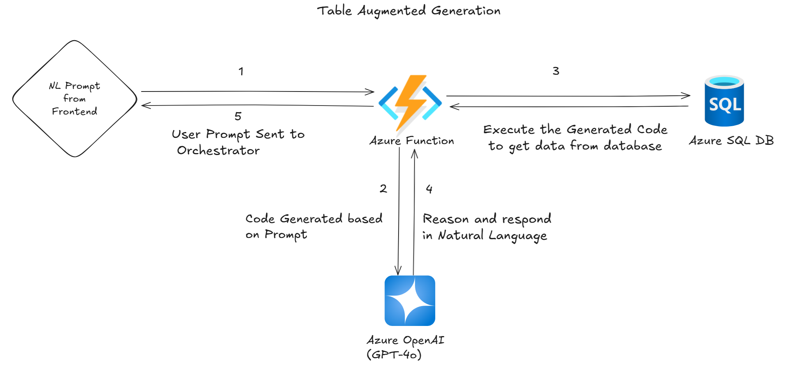
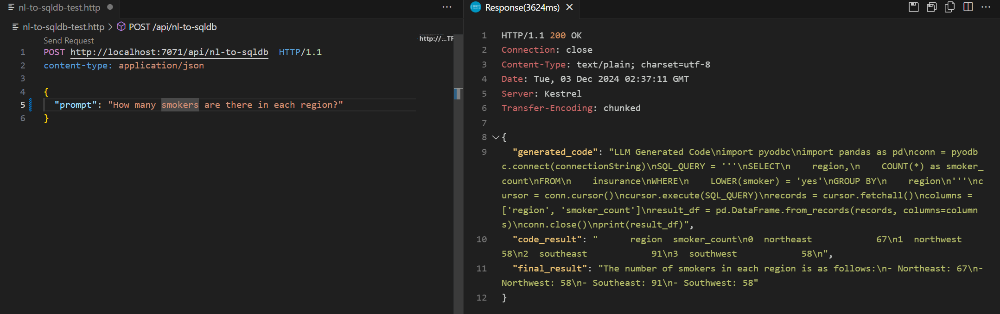
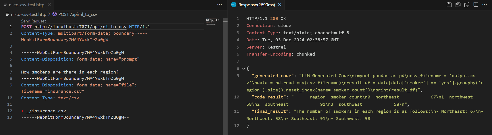

# Table Augmented Generation for Structured Data Interaction

## Solution Overview

This solution demonstrates a table augmented generation approach to facilitate natural language interaction with structured data. It uses **Azure Functions** as the orchestrator and integrates with **GPT-4** for code generation and reasoning. The design ensures an efficient and seamless way to interact with structured data by combining natural language understanding with powerful data-handling capabilities.

Key features include:

1. **Dynamic Code Generation**: The solution generates Python code to query SQL Server tables and answer user questions effectively.
2. **CSV File Support**: It processes uploaded CSV files, enabling data analysis and insights generation.
3. **Scalability and Flexibility**: The approach is adaptable and can be extended to support various data sources beyond SQL Server or CSV.

Note: This solution utilizes the LangChain framework. Alternatively, you may choose to use Semantic Kernel or LlamaIndex, depending on your familiarity and comfort level with these tools.

## Solution Architecure



## Prerequisites

- [Azure Functions Core Tools](https://docs.microsoft.com/en-us/azure/azure-functions/functions-run-local)
- [Python 3.11+](https://www.python.org/downloads/)
- [Visual Studio Code](https://code.visualstudio.com/) with the [Azure Functions extension](https://marketplace.visualstudio.com/items?itemName=ms-azuretools.vscode-azurefunctions)

## Setup

1. **Clone the repository:**

    ```sh
    git clone <repository-url>
    cd <repository-directory>
    ```

2. **Create a virtual environment:**

    ```sh
    python -m venv .venv
    ```

3. **Activate the virtual environment:**

    - **Windows:**

        ```sh
        .venv\Scripts\activate
        ```

    - **macOS/Linux:**

        ```sh
        source .venv/bin/activate
        ```

4. **Install the required packages:**

    ```sh
    pip install -r requirements.txt
    ```

5. **Configuration:**

    Ensure the [local.settings.json](http://_vscodecontentref_/0) file contains the necessary environment variables for connecting to the SQL database. Create or update the file with the following content:

    ```json
    {
      "IsEncrypted": false,
      "Values": {
        "AzureWebJobsStorage": "UseDevelopmentStorage=true",
        "FUNCTIONS_WORKER_RUNTIME": "python",
        "SQLSERVER": "<your-sql-server>",
        "SQLDATABASE": "<your-database>",
        "SQLUSERNAME": "<your-username>",
        "SQLPASSWORD": "<your-password>"
      }
    }
    ```

6. **Start the Azure Function:**

    ```sh
    func start
    ```

## Running the Function

### HTTP Triggers

1. **`nl-to-sqldb` Trigger:**

    - use nl-to-sqldb-test.http to execute the test with following parameters

    - **Endpoint:** `http://localhost:7071/api/nl-to-sqldb`
    - **Method:** `POST`
    - **Content-Type:** `application/json`
    - **Body:**

        ```json
        {
          "prompt": "How many smokers are there in each region?"
        }
        ```

    - **Description:** This trigger processes a natural language query to analyze data from a SQL database. It generates and executes SQL queries based on the provided prompt and returns the result.




2. **`nl_to_csv` Trigger:** 
     
    - use nl-to-csv-test.http to execute the test with following parameters

    - **Endpoint:** `http://localhost:7071/api/nl_to_csv`
    - **Method:** `POST`
    - **Content-Type:** `multipart/form-data`
    - **Body:**

        ```http
        ------WebKitFormBoundary7MA4YWxkTrZu0gW
        Content-Disposition: form-data; name="prompt"

        How many smokers are there in each region?
        ------WebKitFormBoundary7MA4YWxkTrZu0gW
        Content-Disposition: form-data; name="file"; filename="insurance.csv"
        Content-Type: text/csv

        < ./insurance.csv
        ------WebKitFormBoundary7MA4YWxkTrZu0gW--
        ```


    - **Description:** This trigger processes a natural language query to analyze data from an uploaded CSV file. It generates and executes Python code to analyze the data and returns the result.

## Additional Information

- **Logs:**
    - Logs can be viewed in the terminal where the Azure Function is running.

- **Debugging:**
    - Use the provided [launch.json](http://_vscodecontentref_/1) configuration to attach the debugger in Visual Studio Code.

For more detailed information, refer to the [Azure Functions documentation](https://docs.microsoft.com/en-us/azure/azure-functions/).
